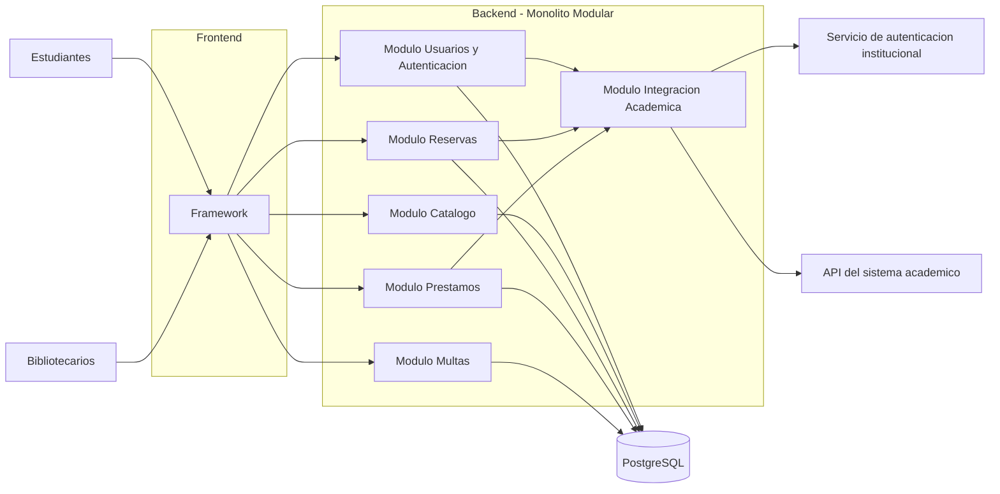

# BiblioUNSA — Laboratorio 04: Fundamentos de arquitectura de software
Construcción de Software · EPIS-UNSA · 2026-B · Grupo B

## Integrantes
| Nombre | Rol en el laboratorio |
|--------|------------------------------------------------------------------------------|
| Joaquin Alejandro Quispe Bedregal | Drivers, matriz, Mermaid, ADR-001, bitacora IA |
| Jose Leon Enrique Hatches Curo | ADR-002, PlantUML, bitacora IA |
| Romina Giuliana Camargo Hilachoque | ADR-003, despliegue, bitacora IA |

## Caso
BiblioUNSA es una plataforma para la gestión de servicios de biblioteca universitaria, en donde, los estudiantes pueden buscar libros por distintos criterios, consultar su disponibilidad, realizar reservas y gestionar cancelaciones. Los bibliotecarios pueden registrar préstamos mediante el carné QR de los estudiantes, además de administrar multas y devoluciones. El sistema también debe integrarse con los servicios institucionales para autenticar usuarios y validar la matrícula mediante la API del sistema académico. El atributo de calidad crítico es la seguridad e interoperabilidad, debido a que el sistema maneja información de usuarios y depende de una integración confiable con servicios externos de la universidad.

## Arquitectura elegida

## Decisiones arquitectónicas
- [ADR-001: Estilo arquitectónico](docs/architecture/adr/001-estilo-arquitectonico.md)
- [ADR-002: Base de datos](docs/architecture/adr/002-base-de-datos.md)
- [ADR-003: Integración académica](docs/architecture/adr/003-integracion-academica.md)

## Reflexión sobre el uso de la IA
La IA fue útil para proponer alternativas arquitectónicas, comparando ventajas y riesgos, lo que fue útil para la elaboración de matriz de decisión y así elegir la arquitectura para el proyecto, tomando en cuenta los requisitos y restricciones del proyecto elegido. Sin embargo, en algunos casos la IA realizó afirmaciones que no tomaban en cuenta todas las restricciones del proyecto, como la cantidad de integrantes y el tiempo que se tiene en cuenta para tener el MVP. Gracias a ello, algunas respuestas tuvieron que ser corregidas para poder aceptarlas posteriormente. En conclusión, la IA es una gran herramienta que acelera el proceso de desarrollo de forma eficaz, aunque a veces deba ser corregida.
